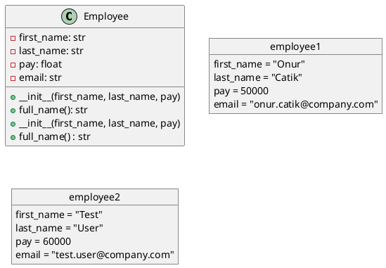

```plantuml
@startuml

class Employee {
    -first_name: str
    -last_name: str
    -pay: float
    -email: str
    +__init__(first_name, last_name, pay)
    +full_name(): str
}

Employee : +__init__(first_name, last_name, pay)
Employee : +full_name() : str

object employee1 {
    first_name = "Onur"
    last_name = "Catik"
    pay = 50000
    email = "onur.catik@company.com"
}

object employee2 {
    first_name = "Test"
    last_name = "User"
    pay = 60000
    email = "test.user@company.com"
}

@enduml

```