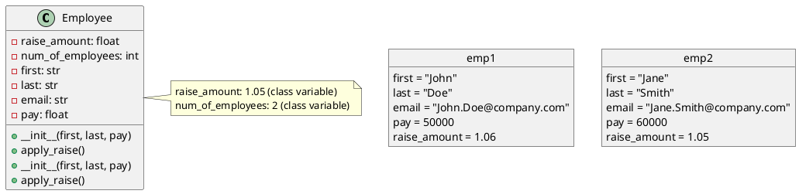

```plantuml
@startuml

class Employee {
    -raise_amount: float
    -num_of_employees: int
    -first: str
    -last: str
    -email: str
    -pay: float
    +__init__(first, last, pay)
    +apply_raise()
}

Employee : +__init__(first, last, pay)
Employee : +apply_raise()

object emp1 {
    first = "John"
    last = "Doe"
    email = "John.Doe@company.com"
    pay = 50000
    raise_amount = 1.06
}

object emp2 {
    first = "Jane"
    last = "Smith"
    email = "Jane.Smith@company.com"
    pay = 60000
    raise_amount = 1.05
}

note right of Employee
    raise_amount: 1.05 (class variable)
    num_of_employees: 2 (class variable)
end note

@enduml


```