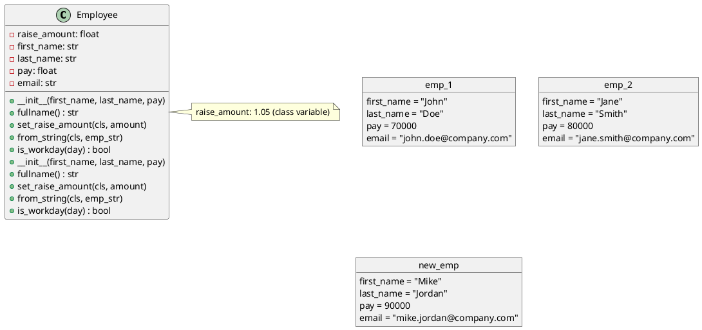

```plantuml
@startuml

class Employee {
    -raise_amount: float
    -first_name: str
    -last_name: str
    -pay: float
    -email: str
    +__init__(first_name, last_name, pay)
    +fullname() : str
    +set_raise_amount(cls, amount)
    +from_string(cls, emp_str)
    +is_workday(day) : bool
}

Employee : +__init__(first_name, last_name, pay)
Employee : +fullname() : str
Employee : +set_raise_amount(cls, amount)
Employee : +from_string(cls, emp_str)
Employee : +is_workday(day) : bool

object emp_1 {
    first_name = "John"
    last_name = "Doe"
    pay = 70000
    email = "john.doe@company.com"
}

object emp_2 {
    first_name = "Jane"
    last_name = "Smith"
    pay = 80000
    email = "jane.smith@company.com"
}

object new_emp {
    first_name = "Mike"
    last_name = "Jordan"
    pay = 90000
    email = "mike.jordan@company.com"
}

note right of Employee
    raise_amount: 1.05 (class variable)
end note

@enduml

```