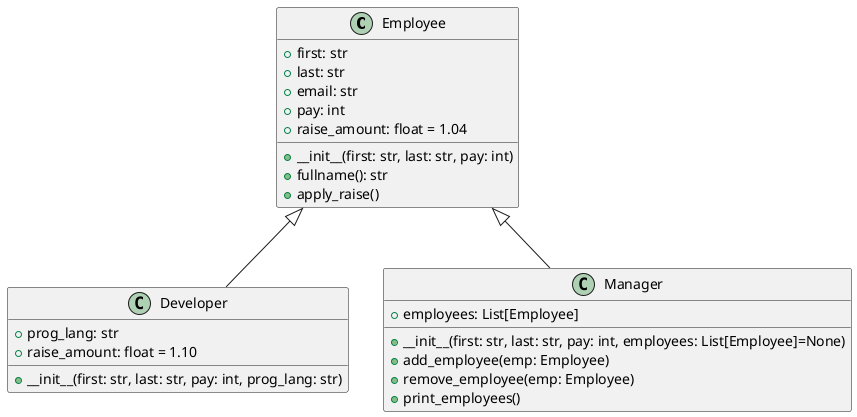

```plantuml
@startuml
class Employee {
    +first: str
    +last: str
    +email: str
    +pay: int
    +raise_amount: float = 1.04
    +__init__(first: str, last: str, pay: int)
    +fullname(): str
    +apply_raise()
}

class Developer {
    +prog_lang: str
    +raise_amount: float = 1.10
    +__init__(first: str, last: str, pay: int, prog_lang: str)
}

class Manager {
    +employees: List[Employee]
    +__init__(first: str, last: str, pay: int, employees: List[Employee]=None)
    +add_employee(emp: Employee)
    +remove_employee(emp: Employee)
    +print_employees()
}

Employee <|-- Developer
Employee <|-- Manager

@enduml

```