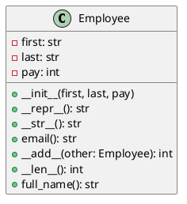

```plantuml

@startuml

class Employee {
    - first: str
    - last: str
    - pay: int

    + __init__(first, last, pay)
    + __repr__(): str
    + __str__(): str
    + email(): str
    + __add__(other: Employee): int
    + __len__(): int
    + full_name(): str
}

@enduml
```