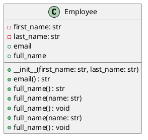

```plantuml

@startuml

class Employee {
    - first_name: str
    - last_name: str
    + __init__(first_name: str, last_name: str)
    + email() : str
    + full_name() : str
    + full_name(name: str)
    + full_name() : void
}

Employee : + email
Employee : + full_name
Employee : + full_name(name: str)
Employee : + full_name() : void

@enduml


```